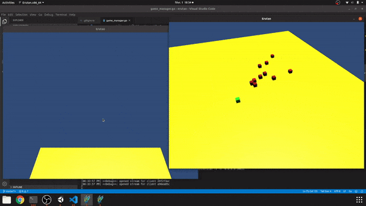
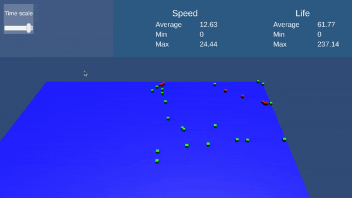

# Erutan-unity

Trying to simulate evolution, synchronized over gRPC to clients that render a 3D visualisation.

To be used with [the go server](https://github.com/The-Tensox/Erutan-go)

[](https://www.youtube.com/watch?v=OElXIRdJFVs)



**Culling**


## Install gRPC

1. Install [NuGetForUnity](https://github.com/GlitchEnzo/NuGetForUnity), all the dependencies are in Assets/packages.config,
restore packages with NuGet
2. Download grpc csharp plugin and protoc

### Troubleshoot

- Be sure to install versions in packages.config, for example Google.Protobuf doesn't work after 3.10.0.
- Grpc.Core only include ios and android dlls = find a way to download the linux, windows
- Be sure to use the c-based protobuf/grpc not the .NET version
- Can't compile protos? check you have the binaries

## Usage

The Makefile is optimized for Linux, so if you're on different OS just read and adapt (will give instructions later).


```bash
make proto
make build
make run
```


```bash
# Monitor logs
tail -f ~/.config/unity3d/com.erutan/Erutan/Player.log
```


## Features

- Stateless front-end
- Render what it receives
- Can requests server for updates (tweak time-scale, spawn objects ...)
- PC optimized atm, soon will do the necessary for targeting mobile, maybe web too
