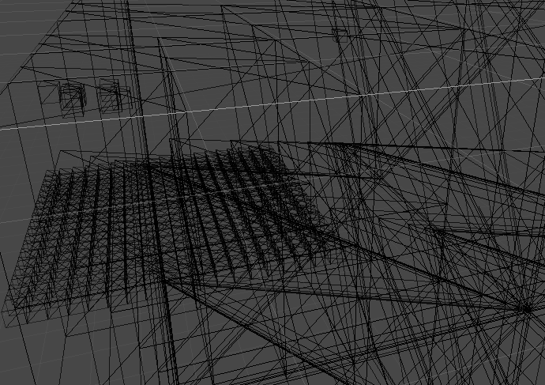

# Erutan-unity

Trying to simulate evolution, synchronized over gRPC to clients that render a 3D visualisation.

To be used with [the go server](https://github.com/The-Tensox/Erutan-go)

[](https://www.youtube.com/watch?v=OElXIRdJFVs)


**Octree ugly visualisation**


## Usage

The Makefile is optimized for Linux, so if you're on different OS just read and adapt (will give instructions later).
(you need to have installed gRPC for Unity, documentation incoming)

```bash
make proto
make build
make run
```

## Features

- Stateless front-end
- Render what it receives
- Can requests server for updates (tweak timeframe, spawn objects ...)
- PC optimized atm, soon will do the necessary for targetting mobile, maybe web too
